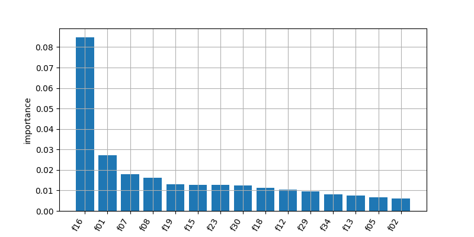
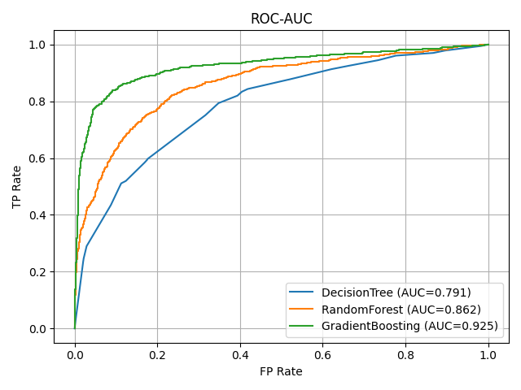

# HW06 – Report
## 1. Dataset

- Какой датасет выбран: `S06-hw-dataset-02.csv`
- Размер: (18000, 39)
- Целевая переменная: `target` (классы и их доли)
- Признаки: числовые

## 2. Protocol

- Разбиение: train/test (доля = 0.2, random_state = 42)
- Подбор: CV на train
*Использовал:*
"max_depth": [1, 5],
"min_samples_leaf": [1, 5],
- Метрики: accuracy, f1, ROC-AUC.
В бинарной классификации сравнение моделей происходит по метрике ROC-AUC. Метрики accuracy, f1 используются для проверки модели на точность, адекватность.

## 3. Models

Baseline:
- DummyClassifier (strategy='most_frequent')
- LogisticRegression (max_iter=1000)

*Использовал контроль сложности `max_depth`, `min_samples_leaf` для следующих моделей:*
- DecisionTreeClassifier
- RandomForestClassifier
- GradientBoosting

## 4. Results

|Model|Accuracy|F1|ROC-AUC|
|:-|:-|:-|:-|
|DummyClassifier|0.7375|0.0|0.5|
|LogisticRegression|0.812|0.56|0.798|
|DecisionTree|0.792|0.423|0.79|
|RandomForest|0.8072|0.4466|0.862|
|GradientBoosting|0.8983|0.7855|0.9246|

По критерию ROC-AUC выигрывает модель GradientBoosting

## 5. Analysis

- Устойчивость:
При изменении параметра random_state на моделях `DecisionTree` и `RandomForest`, DecisionTree показывает стандартное отклонение f1 равно 0.06, что говорит о низкой устойчивости по сравнению с моделью RandomForest (около 0.025). Стандартное отклонение roc-auc у модели DecisionTree равно 0.0052, у модели RandomForest - 0.007.
- Ошибки: confusion matrix для лучшей модели (GradientBoosting):

confusion matrix:
```python
[[2564   91]
 [ 275  670]]
 ```
- Интерпретация: permutation importance

Топ 5 важных признаков оказались f16, f01, f07, f08, f19 \

\
\
\
График метрики roc-auc трех моделей \



## 6. Conclusion

- Изучил модели деревья решений и ансамбли,
- Научился выбирать и регулировать сложность дерева с помощью ключевых гиперпараметров и CV,
- Сравнил модели разных ансамбли и выявил лучшую при помощи метрики ROC-AUC,
- Cохранил результаты артефактов (метрики, параметры, модели) в отдельные json файлы и написал общий md файл о всей проделанной работе.
